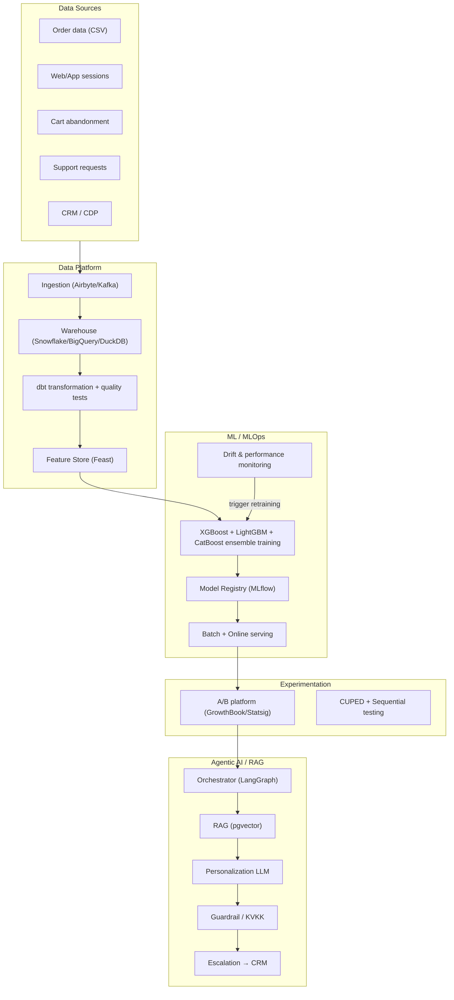

# LLM-Powered Re-Engagement Flow

An enterprise-grade **Churn Prediction → Experimentation Platform → Agentic
AI/RAG** end-to-end re-engagement platform.

[](https://github.com/koraysrn/Retention_Intelligence)
[](.python-version)
[](https://github.com/astral-sh/ruff)
[](.pre-commit-config.yaml)
[](dbt/dbt_project.yml)

> **Source data:** [`ecommerce_data.csv`](ecommerce_data.csv)

---

## 1. Project Purpose

1. **Churn Model:** Predict customers at high risk of churn from anonymized
   e-commerce customer data.
2. **Experimentation Platform:** Measure whether a discount/offer campaign
   applied to high-risk customers actually reduces churn via A/B testing.
3. **Agentic AI / RAG:** A multi-agent system that produces personalized
   emails/offers per customer based on past purchases and, when necessary,
   forwards a summary report to a sales representative.

---

## 2. Architecture Overview



Details: [`docs/architecture.md`](docs/architecture.md)

---

## 3. Repository Structure

```text
.
├── .github/
│   ├── workflows/ci.yml           # CI: lint, typecheck, tests, frontend build
│   ├── ISSUE_TEMPLATE/            # Bug report & feature request forms
│   └── dependabot.yml             # Automated dependency updates
├── configs/                       # YAML configurations
├── data/
│   ├── raw/                       # Ingested raw data (gitignored)
│   └── processed/                 # dbt mart tables & features (gitignored)
├── dbt/                           # dbt transformation models + tests
│   ├── dbt_project.yml
│   ├── profiles.example.yml       # Profile template (real one is gitignored)
│   └── models/
│       ├── staging/               # Raw data cleaning (stg_customers.sql)
│       └── mart/                  # Business layer (customer features, labels)
├── docs/                          # Design documents
├── frontend/                      # React + Vite dashboard
│   └── src/
├── scripts/                       # End-to-end pipeline scripts
├── src/                           # Application code
│   ├── agents/                    # Multi-agent RAG system
│   ├── cdp/                       # Customer data platform client
│   ├── channels/                  # Notification channels
│   ├── data/                      # Data loading and validation
│   ├── experiments/               # A/B design, CUPED, analysis
│   ├── features/                  # RFM + feature engineering
│   ├── models/                    # Training, evaluation, SHAP
│   ├── monitoring/                # Drift detection & retraining
│   ├── serving/                   # Batch scoring + FastAPI
│   └── streaming/                 # Event streaming pipeline
├── tests/                         # Unit and data quality tests
├── .env.example                   # Environment variable template
├── .gitattributes                 # Line-ending & binary file rules
├── .gitignore                     # Ignored files (secrets, data, artifacts)
├── .pre-commit-config.yaml        # Pre-commit hooks
├── .python-version                # Target Python version (3.14)
├── CODE_OF_CONDUCT.md
├── CONTRIBUTING.md
├── Makefile                       # Frequently used commands
├── README.md                      # This file
├── SECURITY.md
├── docker-compose.yml             # Local infra (pgvector, MLflow, MinIO)
├── pyproject.toml                 # Dependencies and tool configuration
└── requirements.txt               # Full extra-set installer
```

---

## 4. Documentation

| Document | Content |
|---|---|
| [`docs/architecture.md`](docs/architecture.md) | End-to-end enterprise architecture and diagrams |
| [`docs/churn_definition.md`](docs/churn_definition.md) | Churn label definition, time window, leakage prevention |
| [`docs/metrics.md`](docs/metrics.md) | Rationale for model metric selection |
| [`docs/ab_test_design.md`](docs/ab_test_design.md) | Experiment design, sample size, CUPED, statistical decision |
| [`docs/agentic_ai_design.md`](docs/agentic_ai_design.md) | Multi-agent RAG workflow and guardrails |

---

## 5. Setup

```bash
# Python 3.14 (latest stable release; the full stack is validated on it)
python -m venv .venv
.venv\Scripts\activate           # Windows
.venv\Scripts\python -m pip install -e ".[dev,ml,experiment,serving,mlops,monitoring,agents,dbt]"

# Start the local infrastructure (pgvector + MLflow + MinIO)
docker compose up -d

# Environment variables
copy .env.example .env            # Windows cmd
# cp .env.example .env            # Linux/macOS
```

### 5.1 Versioning Policy

All dependencies are pinned to the latest stable releases. Current versions can
be audited with a single command:

```bash
python -m scripts.audit_versions
```

> **The only known exception — pandas:** [`mlflow 3.15.1`](https://pypi.org/project/mlflow/)
> still imposes a `pandas<3` constraint, so `pandas 2.3.3` (the latest 2.x
> release) is used for full-stack compatibility. Upgrading to `pandas>=3` is a
> one-line change once mlflow publishes pandas 3 support.

---

## 6. Roadmap

| Phase | Scope | Status |
|---|---|---|
| Phase 0 | Data exploration and quality report | ✅ |
| Phase 1 | dbt + Feature Store + feature engineering | ✅ |
| Phase 2 | Churn model (LightGBM/XGBoost) + metrics | ✅ |
| Phase 3 | A/B experiment design and analysis | ⬜ |
| Phase 4 | Agentic AI / RAG pipeline | ⬜ |
| Phase 5 | Serving, monitoring, drift, retraining | ⬜ |
| Phase 6 | Streaming + CDP + multi-channel scaling | ⬜ |

---

## 7. Quick Commands

```bash
make ingest        # Phase 1: CSV -> DuckDB raw ingestion
make dbt-run       # Phase 1: run dbt models
make dbt-test      # Phase 1: dbt tests
make features      # Phase 1: build the feature set from mart tables
make lint          # Ruff + mypy
make test          # pytest
make train         # churn model training
make score         # batch risk scoring
make ab-analyze    # A/B analysis
make run-api       # start the serving API
```

---

## 8. Contributing

Contributions are welcome. See [`CONTRIBUTING.md`](CONTRIBUTING.md) for the
development workflow and [`CODE_OF_CONDUCT.md`](CODE_OF_CONDUCT.md) for
community standards.

## 9. Security

To report a vulnerability privately, see [`SECURITY.md`](SECURITY.md).
