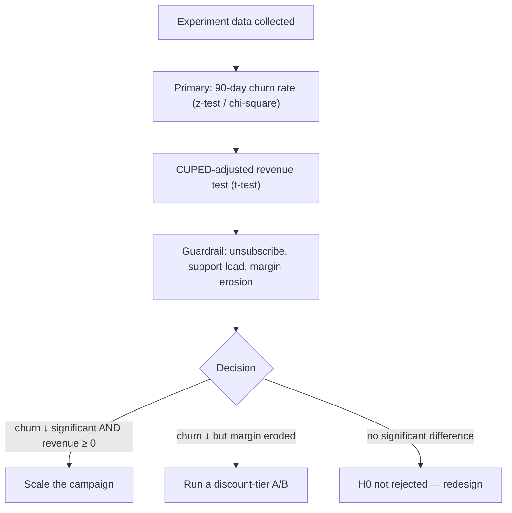

# A/B Test Design

An experiment design that measures whether a personalized offer campaign
applied to customers at high churn risk reduces the churn rate and its impact on
revenue.

## 1. Hypotheses

| # | Hypothesis |
|---|---|
| H0 (primary) | The campaign does not change the 90-day churn rate relative to the control group |
| H1 (primary) | The campaign reduces the 90-day churn rate statistically significantly |
| H0 (secondary) | The campaign does not change net revenue (revenue − discount cost) |
| H1 (secondary) | The campaign increases net revenue |

## 2. Experiment Parameters

| Parameter | Proposed value | Rationale |
|---|---|---|
| Baseline churn rate | Computed from data (example: 20%) | Power analysis input |
| MDE (minimum detectable effect) | Absolute −4pp (relative −20%) | Smallest effect the business considers "meaningful" |
| α (type-I error) | 0.05 (two-tailed) | Industry standard |
| Power (1−β) | 0.80 | Industry standard |
| Control / treatment ratio | 50 / 50 | Maximum statistical efficiency |
| Randomization | Stratified (risk decile, country, gender, tenure) | Pre-experiment balance between groups |
| Unit of analysis | Customer (customer_id) | The intervention is at customer level |

## 3. Sample Size

For a two-proportion test:

```text
n (per group) = (Zα/2 + Zβ)² × [p1(1−p1) + p2(1−p2)] / (p1 − p2)²
```

Example calculation (`p1 = 0.20`, `p2 = 0.16`, `α = 0.05`, `power = 0.80`):

```text
Zα/2 = 1.96, Zβ = 0.84
n = (1.96 + 0.84)² × (0.16 + 0.1344) / (0.04)²
  = 7.84 × 0.2944 / 0.0016
  ≈ 1.443  →  ~1,450 per group, ~2,900 total
```

With a 20% buffer: **~3,500 customers total**.

MDE sensitivity:

| MDE (relative) | Absolute effect | n per group (approx) |
|---|---|---|
| −20% | −4pp | ~1,450 |
| −15% | −3pp | ~2,580 |
| −10% | −2pp | ~6,030 |

## 4. Variance Reduction: CUPED

Variance is reduced for continuous metrics such as revenue by using
pre-experiment (pre-period) metrics:

```text
Y_adjusted = Y − θ × (X_pre − X̄_pre)
```

`X_pre` is the pre-experiment value of the same metric (e.g. revenue in the
last 30 days). CUPED reduces variance by **10–50%** depending on correlation and
reduces the required sample size.

## 5. Statistical Decision Procedure



- **Peeking control:** When multiple looks occur during the analysis,
  O'Brien-Fleming α-spending (sequential testing) is used.
- **Decision rule:** The campaign is rolled out only when there is **both** a
  significant churn reduction **and** a non-negative effect on net revenue.

## 6. Tracked Metrics

| Type | Metric |
|---|---|
| Primary | 90-day churn rate |
| Secondary | Net revenue, AOV, purchase frequency, conversion |
| Guardrail | Unsubscribe rate, support request increase, margin erosion |
| Health | SRM (sample ratio mismatch) check, group sizes |

## 7. Implementation Steps

1. Power analysis and sample size via `python -m src.experiments.sample_size --baseline ...`.
2. Stratified assignment + analysis + report via `python -m scripts.run_ab_experiment`.
3. Metric logging for the duration of the experiment (immutable event log).
4. CUPED + z-test/t-test + sequential test via `python -m src.experiments.analysis`.
5. Result report (p-value, confidence interval, effect size, lift).
