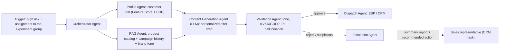
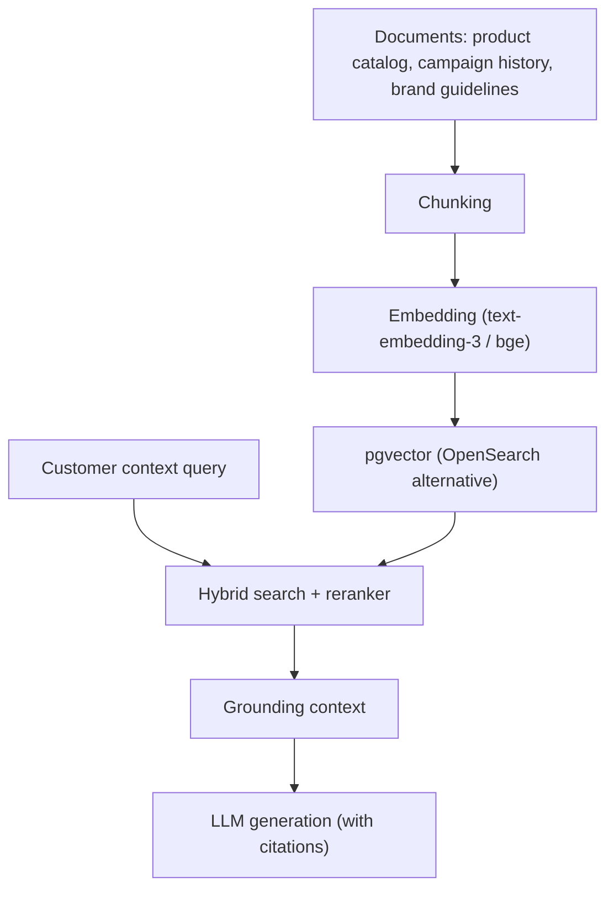

# Agentic AI / RAG Design

Instead of sending standard emails to customers at high churn risk, this is a
multi-agent system that produces personalized content based on past purchases
and categories and, when necessary, forwards a summary report to a sales
representative.

## 1. Workflow



## 2. Agents and Responsibilities

| Agent | Responsibility | Tools used |
|---|---|---|
| **Orchestrator** | Plans the workflow, invokes agents, manages retry/fallback | LangGraph state machine |
| **Profile Agent** | Customer history, category affinity, LTV, risk reason (SHAP) | Feature Store API, CRM |
| **RAG Agent** | Product catalog, past campaign performance, brand guideline context | pgvector, reranker |
| **Content Generation** | Produces personalized email/offer drafts | LLM (provider-agnostic) |
| **Validation (Guardrail)** | KVKK compliance, PII leak, incorrect discount/product claim checks | Rule set + LLM-as-judge |
| **Escalation** | Detects cases requiring human intervention, produces a summary report | CRM task API, summarization LLM |

## 3. RAG Design



- **Chunking:** Semantic chunking based on the structure of product and campaign
  documents.
- **Grounding:** Generated text is tied to the retrieved documents by citation.
- **Reranker:** Re-ranks relevance within the first k results (cohere/bge-reranker).

## 4. Guardrail Layers

1. **Deterministic rules:** PII regex scanning, forbidden words/tone, brand
   rules, discount limit checks.
2. **Model-based validation:** LLM-as-judge; consistency of generated text with
   context and hallucination checks.
3. **KVKK/GDPR:** PII is never sent to the LLM raw; it is masked first.
   Automated-decision notification and the right to erasure are supported.

## 5. Escalation Rules

Content is not sent automatically and the Escalation Agent takes over in the
following cases:

- The customer is in the **high LTV** segment and the content confidence score
  is low.
- Guardrail validation returned `red`.
- The customer history contains a **support complaint / sensitive situation**.
- The offer amount exceeds the approval threshold.

The Escalation Agent produces a summary for the sales representative containing:

```text
- Customer profile and risk reason (SHAP)
- Proposed offer and its rationale
- Signals requiring attention (complaint, cancellation tendency)
- Recommended action (call, special offer, win-back campaign)
```

## 6. Framework Selection

| Option | Advantages | Disadvantages |
|---|---|---|
| LangGraph | State machine, checkpoint, visualization, enterprise adoption | Learning curve |
| OpenAI Agents SDK | Simple, fast prototyping | Vendor dependency |
| CrewAI | High-level role-based | Finer control is harder |

**Recommendation:** LangGraph — for enterprise auditability (checkpoint,
tracing) and provider independence. LLM calls go through a **provider
abstraction layer** (OpenAI / Anthropic / Azure / Bedrock / Ollama).

## 7. Observability

- Every agent step is traced (LangSmith / Langfuse).
- Generated content, used context and validation results are logged for audit.
- On agent failures, retry + circuit breaker + a fallback template take over.
