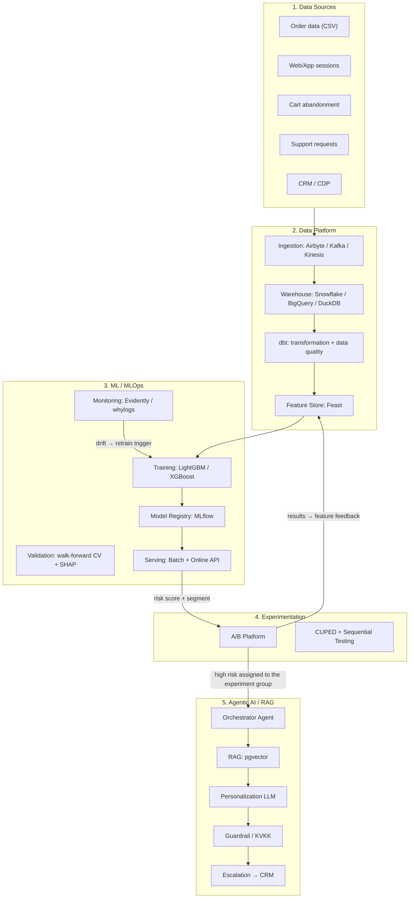
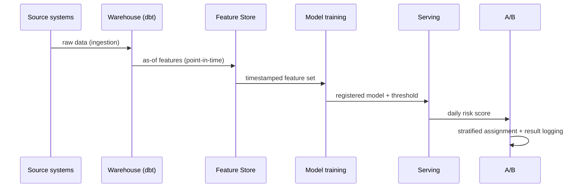
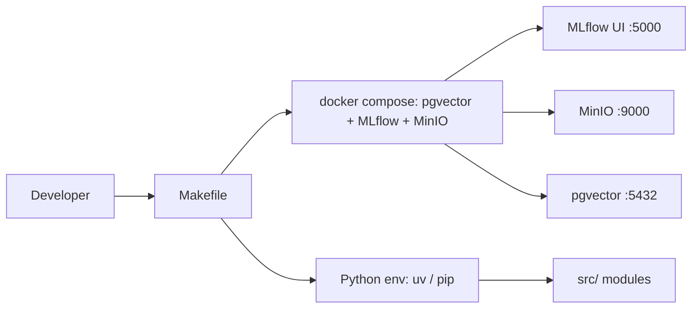

# Enterprise Architecture

This document defines the end-to-end enterprise architecture of the platform.
The architecture runs the **Data → Feature → Model → Experiment → Agent →
Monitoring** loop as a closed circuit.

## 1. High-Level Architecture

## 2. Layer Responsibilities

### 2.1 Data Sources

| Source | Content | Counterpart in this repo |
|---|---|---|
| Orders (CSV) | `order_id`, `customer_id`, amount, quantity, category | [`data/raw/`](../data/raw/) |
| Web/App sessions | Session duration, page views | External source (CDP) — generated synthetically |
| Cart abandonment | Abandoned carts | External source — generated synthetically |
| Support requests | Ticket count and sentiment | External source (CRM) |
| CRM/CDP | Customer 360 profile, LTV | Salesforce / Segment |

### 2.2 Data Platform

- **Ingestion:** Airbyte for batch, Kafka/Kinesis for real-time events.
- **Warehouse:** DuckDB in the prototype, Snowflake/BigQuery in enterprise.
- **dbt:** Transforms raw data into a cleaned staging layer, then into a
  customer-level mart layer. `unique`, `not_null` and `accepted_values` tests
  are mandatory for every model. Details: [`dbt/`](../dbt/dbt_project.yml).
- **Feature Store (Feast):** Training and serving use the same feature
  definitions, preventing `train/serve skew`. Leakage is prevented with
  point-in-time (as-of) queries.

### 2.3 ML / MLOps

- Training pipeline: [`src/models/train.py`](../src/models/train.py).
- Models and metrics are versioned in the MLflow Registry.
- Validation uses **time-based walk-forward CV** (details:
  [`docs/churn_definition.md`](churn_definition.md)).
- Serving runs in two modes:
  1. **Batch:** Daily risk score computation and A/B assignment.
  2. **Online:** Real-time score over the API (cart abandonment trigger).
- Data/concept drift is detected via monitoring; retraining is triggered when
  the threshold is exceeded.

### 2.4 Experimentation

- Experiment group assignment is stratified over
  `risk decile + country + gender + tenure`.
- Analysis uses CUPED variance reduction and sequential testing
  (O'Brien-Fleming). Details: [`docs/ab_test_design.md`](ab_test_design.md).

### 2.5 Agentic AI / RAG

- The Orchestrator (LangGraph) coordinates the agents.
- RAG retrieves the product catalog + past campaign performance + brand
  guidelines over pgvector.
- The guardrail agent enforces KVKK/GDPR compliance and PII leak prevention.
- Details: [`docs/agentic_ai_design.md`](agentic_ai_design.md).

## 3. Data Flow (Point-in-time Correctness)

## 4. Enterprise Requirements (Non-functional)

| Requirement | Implementation |
|---|---|
| Reproducibility | Model + data + code versions recorded together (MLflow run ID) |
| Traceability | Feature snapshot and model version logged for every prediction |
| Security | RBAC, VPC, PII masking, Vault secret management |
| Auditability | Audit log, model cards, SHAP explanations |
| Regulation | KVKK/GDPR: explicit consent, automated-decision notification, right to erasure |
| Scalability | Batch + streaming hybrid, horizontally scaled serving |

## 5. Local Development Infrastructure

Local infrastructure definition: [`docker-compose.yml`](../docker-compose.yml).
